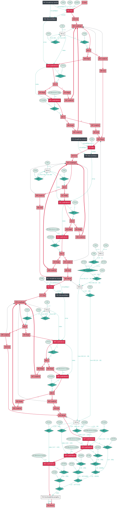
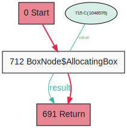

# Truffle based .NET IL interpreter and compiler: run C# on Java Virtual Machine

# Abstract

Interpreted and just-in-time (JIT) compiled languages are becoming more and more prevalent, with JavaScript and Python ranking in TOP 5 most popular programming languages in most surveys and statistics. In the academic and research settings, the ability to quickly prototype programming languages and test their properties also works in favor of interpreted languages, as implementing an interpreter is considerably easier than implementing a compiler. However, simple interpreters suffer from a substantial tradeoff of performance. Traditionally, if an interpreted language is to become effective and run fast, it requires creating a custom infrastructure of JIT compilers and optimizations just for that single specific language.

The Truffle Language Implementation Framework [^1] attempts to alleviate this tradeoff between performance and development complexity by providing a framework for implementing a language using interpreter-style code that is later JIT compiled by the GraalVM compiler [^2]. While straightforward interpreter-style implementations in Truffle might not perform much better than simple interpreters, Truffle provides a framework for writing optimization hints that are later used by the compiler. According to Thomas Würthinger et al. [^3], such implementations can compete with hand-crafted compilers.

The goal of the thesis is to implement an interpreter of a subset of Common Intermediate Language (CIL) using Truffle, such that CIL code can be run on the Java Virtual Machine. CIL is an intermediate language to which .NET applications are typically compiled, including applications written in the C# programming language. The CIL is standardized in ECMA-335 [^4]. The focus of the work will be on the feasibility of implementing an interpreter of an actual language using the Truffle interpreter-style approach in an academic setting, and comparing the resulting performance of said academic implementation with state of the art CIL JIT compilers.

[^1]: https://github.com/oracle/graal/tree/master/truffle
[^2]: https://github.com/oracle/graal/tree/master/compiler
[^3]: Wuerthinger et al.: Practical Partial Evaluation for High-Performance Dynamic Language Runtimes, https://doi.org/10.1145/3062341.3062381
[^4]: https://www.ecma-international.org/publications/standards/Ecma-335.htm

# Introduction

## Problem

Traditionally, when implementing a programming language, achieving high performance required a significant development effort and resulted in complicated codebases.

While writing an interpreter for even a fairly complicated language is achievable for a single person interested in the topic, state of the art optimizing compilers are usually created over several years by large teams of developers at the largest of IT companies. Not only was kickstarting such a project unthinkable for an individual, introducing changes to an already existing project is far from simple.

For example, Google's state of the art JavaScript engine V8 currently has two different JIT compilers and its own internal bytecode. An experiment of adding a single new bytecode instruction to the project can mean several days of just orientating in the codebase.

As cybersecurity becomes a more important topic, another factor to consider is that creating manual optimizations in JITs is very prone to bugs which can have very grave security implications. Speculated assumptions of JIT compilers introduced whole new bug families, for example "type confusion". Implementing a JIT that is not only performant but also secure is proving to be difficult even for state of the art projects.

These factors resulted in academic and hobby experimentation with programming languages being mostly stuck with low-performance simple interpreters. [Qualitative Assessment of Compiled, Interpreted and Hybrid Programming Languages](https://www.researchgate.net/publication/320665812_Qualitative_Assessment_of_Compiled_Interpreted_and_Hybrid_Programming_Languages) concludes that

> Interpreters are very good development tools since it [sic] can be easily edited, and are therefore ideal for beginners in programming and software development. However they are not good for professional developers due to the slow execution nature of the interpreted code.

## .NET 

TODO
* what it is etc.
* mention that we definitely don't want to implement the standard library

## Truffle and Graal

To implement a high-performance .NET runtime, we alleviate the 
 [Truffle language implementation framework](https://www.graalvm.org/graalvm-as-a-platform/language-implementation-framework/) (henceforth "Truffle") and the [GraalVM Compiler](https://www.graalvm.org/22.1/docs/introduction). 

TODO  high level what it is

### Partial Evaluation

TODO what is it and how it works

### `MERGE_EXPLODE` strategy

TODO it's a game changer

(emphasis added)

> like `ExplodeLoop.LoopExplosionKind.FULL_EXPLODE`, but copies of the loop body that have the exact same state (all local variables have the same value) are merged. This reduces the number of copies necessary, but can introduce loops again. **This kind is useful for bytecode interpreter loops.**


## Previous work

Truffle was originally described as "a novel approach to implementing AST interpreters" in [Self-Optimizing AST Interpreters (2012)](https://dl.acm.org/doi/10.1145/2384577.2384587) and wasn't directly applicable for our bytecode intepreter problem.

[Bringing Low-Level Languages to the JVM: Efficient Execution of LLVM IR on Truffle (2016)](https://dl.acm.org/doi/10.1145/2998415.2998416) implemented Sulong, a LLVM IR (bytecode) runtime, and showed "how a hybrid bytecode/AST interpreter can be implemented in Truffle". This is already very similar to our current work, however it had to implement its own approach to converting unstructured control flow into AST nodes.

In [Truffle version 0.15 (2016)](https://github.com/oracle/graal/blob/master/truffle/CHANGELOG.md#version-015), the `ExplodeLoop.LoopExplosionKind` enumeration was implemented, providing the [`MERGE_EXPLODE` strategy](#mergeexplode-strategy).

In [GraalVM version 21.0 (2021)](https://www.graalvm.org/release-notes/21_0/), an "experimental Java Virtual Machine implementation based on a Truffle interpreter" was introduced. In general principles, this project is very similiar to our work, using the same approach for a different language.

While [Truffle CIL Interpreter (2020)](https://epub.jku.at/obvulihs/content/titleinfo/5473678) also implemented the CIL runtime, it chose a completely different approach of building an AST from the text representation of IL code. Also, as it admits in the conclusion, it "didn't focus on performance optimization of the different instructions". The same implementation approach was chosen by [truffleclr](https://github.com/alex4o/truffleclr).


# CLI Component parser

Before being able to execute code, it is necessary to read the code from the assemblies. Prior to starting the work, we expected some open source parsers for this format to exist for various languages, including Java. However, the only alternative stand-alone parser (not a component of a full CLI implementation) we found was [dnlib](https://github.com/0xd4d/dnlib) targeting .NET framework itself. If even for such a popular runtime there are no suitable parsers implemented in Java, we feel that the parser implementation step is an important part to consider in the whole "Building an experimental runtime" picture.

## Analysis

### Design goals

Before we started designing and implementing the parser, we considered what additional constraints have to be put on a parser in order for it to be partial-evaluation friendly. For partial-evaluation friendliness, the key metric is how trivial can every piece of code (that can be called a hot path) be partially evaluated to. While our goal was for the parser to never be called on a hot path, for some possible scenarios including reflection it would be necessary.

There are two possible extremes for parser design: "fully lazy" where every query for the file causes it to be parsed from the start, and "fully preloaded" where all the data from the file is immediatelly fully parsed into hierarchies of objects and structures. Practical parsers usually choose a compromise between those two approaches, mainly because the extremes lead to extremely slow runtime or bootup respectively.

Driven by the goal of partial-evaluation friendliness, we decided to design the initial parsing such that:

* trivial queries, e.g. queries for a metadata item at a constant index, would only result in a compilation constant,
* simple queries, e.g. queries for a metadata item at a variable index, would result in a simple offset calculation (multiply and add) and reads from a compilation constant byte[],
* all further parsing necessary for more complex queries (creating objects representing metadata concepts etc.) would be performed lazily by invokers and they should make sure to cache their objects themselves.

### Definition of important CLI component structures

First, we will define terms necessary for understanding our analysis of the complexities of the file format.

Apart from various headers used for locating it, all metadata is stored in streams. There are two basic types of streams: heaps and tables.

Heaps contain sequences of bytes, the meaning of which changes based on the specific heap. The specification defines 4 heaps:

* `#Strings` containing values of identifier strings.
* `#US` containing values of strings used by the program code itself during runtime.
* `#Blob` containing variable-length metadata as binary blobs.
* `#GUID` containing GUIDs.

The tables are stored in a stream called `#~`. This is the root of all metadata information. The specification describes 38 tables. Cell values can be either  a constant or an index. Indices can point to heaps (the value is a byte offset),
another table (the value is a row number), or one of multiple tables (the value is a "coded index" specifying both the table and row number).

For an example of references between these structures, this is what a single row looks like in the metadata table `TypeDef`, which contains definitions of types:

| Column        | Raw value | Comment                                                                                                                                                                             |
|---------------|-----------|-------------------------------------------------------------------------------------------------------------------------------------------------------------------------------------|
| Flags         | 0x100000  | Constant bitmask specifying TypeAttributes.                                                                                                                                         |
| TypeName      | 0x01A9    | An offset into the `#String` heap, where the name of the type can be found. In this example, `Program` was written there.                                                           |
| TypeNamespace | 0x01DE    | An offset into the `#String` heap, where the namespace of the type can be found. In this example, `SampleProject` was written there.                                                |
| Extends       | 0x0031    | A coded index into `TypeDef`, `TypeRef`, or `TypeSpec`. In this example an index to `TypeRef` table index 12, which is a reference to `System.Object`.                              |
| FieldList     | 0x0002    | An index into the `Field` table where fields for this type start. As in this case the type has no fields, the index points past the end of the `Field` table, which has only 1 row. |
| MethodList    | 0x0002    | An index into the `Method` table where methods for this type start. As this type has multiple methods, row 2 of `Method` contains information about `Main`, other methods follow.   |


### Complexities of the CLI component format

Subjectively, we felt the format used by CLI components is not designed well in regards to supporting different parsing approaches and platforms. To substantiate this claim, we want to highlight several factors that complicate parsing the components and had to be considered in the design.

#### PE Wrapping

As stated in ECMA-335 _II.25 File format extensions to PE_:
> The file format for CLI components is a strict extension of the current Portable Executable (PE) File Format. [...] The PE format frequently uses the term RVA (Relative Virtual Address). An RVA is the address of an
item _once loaded into memory_ [...].
> 
> The RVA of an item will almost always differ from its
position within the file on disk. To compute the file position of an item with RVA r, search all the sections in the PE file to find the section with RVA _s_, length _l_ and file position _p_ in which the RVA lies, ie _s ≤ r < s+l_. The file position of the item is then given by _p+(r-s)_.

On Windows (and other theoretical platforms where PE parsing is a service provided by the operating system) this allows for the component to be loaded into virtual memory as any other executable files. RVA addresses can then be resolved transparently by the CPU's and operating system's virtual memory mappings. For all other platforms this adds one more level of indirection that needs to be handled.

As our parser is platform-agnostic and written in Java, we can't use any of those services. Therefore, we need to manually do the sections search and RVA calculations as described in the standard.

#### Metadata tables format

The biggest complexity we encountered during parser design was the format of metadata tables. These tables contain most of the metadata information of the CLI component. 

The data of the tables is stored in the `#~` stream. This stream consists of a header followed by a simple concatenation of values of all rows of all tables with no additional metadata in between. 

The header itself contains only the following fields relevant for locating data in the tables (shortened, for full structure see _II.24.2.6 #~ stream_):

| Offset | Size | Field     | Description                                                                              |
|--------|------|-----------|------------------------------------------------------------------------------------------|
| 6      | 1    | HeapSizes | Bit vector of heap sizes                                                                 |
| 8      | 8    | Valid     | Bit vectors of present tables                                                            |
| 24     | 4*n  | Rows      | Array of n 4-byte unsigned integers indicating the number of rows for each present table |

Herein lies the first issue: no information about table lengths are present. This results in **every single parser implementing the format having to implement the format for every single metadata table**, as skipping a table requires knowing the byte length of its rows. This completely prohibits an iterative developement cycle, adding support for only the necessary tables. For example, to implement an utility that only outputs names of all the types available in the component, while only data from the TypeDef table is necessary, all 38 tables defined in ECMA-335 must be implemented. The BACIL implementation described here only accesses 11 of these tables.

The second caveat comes in _II.22 Metadata logical format: tables_ and _II.24.2.6 #~ stream_:

> Each entry in each column of each table is either a constant or an index.
> 
> [...]
> 
> Each index is either 2 or 4 bytes wide. The index points into the same or another table, or into one of the four heaps. The size of each index column in a table is only made 4 bytes if it needs to be for that particular module. So, if a particular column indexes a table, or tables, whose highest row number fits
in a 2-byte value, the indexer column need only be 2 bytes wide. Conversely, for tables containing 64K or more rows, an indexer of that table will be 4 bytes wide. 
> 
> [...]
> 
> If _e_ is a _coded index_ that points into table _t<sub>i</sub>_ out of _n_ possible tables _t<sub>0</sub>, … t<sub>n-1</sub>_, then it is stored as e << (log n) | tag{ t0, …tn-1}[ t<sub>i</sub>] using 2 bytes if the maximum number of rows of tables  _t<sub>0</sub>, … t<sub>n-1</sub>_, is less than 2<sup>(16 – (log n))</sup>, and using 4 bytes otherwise. 

While this decision saves storage size it means that table row length can't be considered a constant and is dependant on the row count of other tables. For example, a `TypeDef` table row can be from 14 up to 24 bytes in size.

This means that the parser can't workaround the first issue by expecting the table row length be constant.

If we were to try to improve the format to alleviate these issues, we would add information about the row length of present tables into the header. Even if each size was stored as a full byte (which all tables defined in the standard fit into), this would at most increase the binary size by 38 bytes and allow for skipping tables without dealing with their internal row format.

#### Extensive normalisation

File format design is often a compromise between several engineering goals[^5]. One of the design concepts that apply is normalisation, a concept that each information should be stored only once, removing all redundancy. While such a goal can be beneficiary for other uses of the file format (like writing and modifying), from the point of view of a lightly-preloading consumer it results in non-ideal structures.

* In parent-child relationships, only one of the nodes has a direct reference to the other. Traversing the edge from the other side involves enumerating all the possible nodes and searching for one with the appropriate reference. If such queries are performance sensitive, the invoker has to make sure that it caches the answers.

* When referencing a sequence of items in a table, only information about the beginning of the sequence is directly stored. The end of the sequence is either the last row of the table or the start of the next sequence, as specified by the next row, whichever comes first.

    While the complexity this adds usually amounts to a single if statement, it crosses the border between cell value semantics and metadata logical format internals - either the parser has to understand the semantics of cells as "sequence indices" to encapsulate resolving the sequence length, or the invoker has to understand the file format view of row numbers.

[^5]: [A brief look at file format design](http://decoy.iki.fi/texts/filefd/filefd)

## Parser implementation details

### Metadata tables parser

As mentioned in [Metadata tables format](#metadata-tables-format), parsing any metadata tables requires implementing the internal row format for all tables specified in ECMA-335. Implementing all 38 tables manually would both require a big amount of work and make modifications to all parsers complicated. Therefore, this problem sounded like a good opportunity for code generation.

We decided to create a simplified text-file containing information about all the columns in all tables and is also human-readable. For example, the `TypeDef` table (used as an example in [Definition of important CLI component structures](#definition-of-important-cli-component-structures)), was specified like this:

```
TypeDef:02
-Flags:c4
-TypeName:hString
-TypeNamespace:hString
-Extends:iTypeDef|TypeRef|TypeSpec
-FieldList:iField
-MethodList:iMethodDef
```

For simplicity, we ended up writing the code generator in plain Java, outputting Java source files. The result can be seen in [CLITableClassesGenerator](https://github.com/jagotu/BACIL/blob/master/language/src/main/java/com/vztekoverflow/bacil/parser/cli/tables/CLITableClassesGenerator.java).

### CLITableRow and CLITablePtr

We wanted the implementation of accessing metadata table rows to be as safe and simple-to-use as possible while keeping in mind the design goals for partial evaluation. The two operations we expected to be most common were enumerating a single table and resolving indices referencing other tables.

For the enumerating, we made `CLITableRow` implement `Iterable`, allowing for a safe for-each access, completely hiding the internal table details. An example of printing all methods defined in component:

```Java
CLIComponent component = ...;
for (CLIMethodDefTableRow methodDefTableRow : component.getTableHeads().getMethodDefTableHead()) {
    System.out.println(methodDefTableRow.getName().read(component.getStringHeap()));
}
```

For the index resolving, we made the tables return a `CLITablePtr` wrapped index. It can then be directly provided to `CLITableRow`'s `skip` method, which can validate that the table ID is correct. The importance of this wrapping is increased by the following fact mentioned in _II.22 Metadata logical format: tables_:

> Indexes to tables begin at 1, so index 1 means the first row in any given metadata table. (An index value of zero denotes that it does not index a row at all; that is, it behaves like a null reference.)

Exposing the indices as raw integers would allow for off-by-one bugs to become prevalent. Providing a wrapped variant that behaves as expected by default helps combat these issues.

The pattern for safe index resolving looks like this:

```Java
CLIComponent component = ...;
CLITypeDefTableRow typeDef = ...;

CLIFieldTypeRow firstField =  component.getTableHeads().getFieldTableHead().skip(typeDef.getFieldList());
```

### Sequence references

As mentioned in [Extensive normalisation](#extensive-normalisation), sequences of items in a table are stored in a way that requires either implementing column semantics in the parser or the invoker knowing logical table internals. As our table parsers are generated from a definition file, including sequence semantics would require expanding both the generator and the definition file. Instead, we decided to leave the responsibility on the invoker, resulting in code like this (from [CLIType](https://github.com/jagotu/BACIL/blob/master/language/src/main/java/com/vztekoverflow/bacil/runtime/types/CLIType.java#L72)):

```Java
if(type.hasNext())
{
    methodsEnd = type.next().getMethodList().getRowNo();
    fieldRowsEnd = type.next().getFieldList().getRowNo();
} else {
    methodsEnd = component.getTablesHeader().getRowCount(CLITableConstants.CLI_TABLE_METHOD_DEF)+1;
    fieldRowsEnd = component.getTablesHeader().getRowCount(CLITableConstants.CLI_TABLE_FIELD)+1;
}
```

## Conclusion

In the end, designing and implementing the parser took a non-trivial chunk of the development time. Even though straightforward code-size indicators are controversial, we feel that the parser (excluding generated code) consisting of 124131 bytes over 3625 lines of code and the rest of the language package consisting of 256063 bytes over 7103 lines is indicative of the substantiality of the parser.

# Runtime

## Analysis

### Dynamicity of references

One of the additional things to consider when implementing a partial-evaluation friendly interpreter is dynamicity of references, where by dynamicity we mean how often the reference changes its state. This metric is important because effectively the dynamicity of a chain of references will be equal to the most dynamic of the references. As a result, what would usually be considered bad design patterns is sometimes necessary to divide the chain into more direct references, such that each object is reachable with the lowest dynamicity possible.

The following reference graph shows the refactoring in a generic case:


_Scenario 1: Reference chain results in class B being accessible with high dynamicity and therefore not being effectively partially evaluated_


_Scenario 2: Class B is accessible with a low dynamicity reference, resulting in more effective partial evaluation_

For a case study from the BACIL implementation, let's consider the design decisions behind `LocationDescriptor` and `LocationHolder`. Each location has a type and a value. While the value itself (and the type of the value) changes based on the running code, the type of the location never changes. This is a perfect example of two pieces of information with different dynamicity. 

Even from regular developement patterns, it makes sense to divide location values and location types into separate classes - store the location type information in the metadata as a "prototype" for then creating the value storage based on it. In BACIL, `LocationDescriptor` contains the Type information and `LocationHolder` contains the actual values.

To work with the values, it is always necessary to know the location type (mainly to differentiate between ValueTypes and references). The rule of encapsulation would dictate that the final caller doesn't need to know that there's a `LocationDescriptor` tied to the `LocationHolder`, as it's an internal detail. Such an implementation would look something like this:

```Java 
public class LocationHolder {
    private final LocationDescriptor descriptor;

    private final Object[] refs;
    private final long[] primitives;

    public LocationsHolder(LocationDescriptor descriptor) {
        this.descriptor = descriptor;
        refs = new Object[descriptor.getRefCount()];
        primitives = new long[descriptor.getPrimitiveCount()];
    }

    public Object locationToObject(int locationIndex)
    {
        return descriptor.locationToObject(this, locationIndex);
    }

}

//Accessing a field of an object
Object fieldValue = ((StaticObject)object).getLocationsHolder().locationToObject(0);
```

However, using this code results in an unoptimal dynamicity chain and uneffective partial evaluation:


_Scenario 1: As a `LocationHolder` is unique per object instance/method invocation/ etc., the reference to it is highly dynamic. The `LocationDescriptor` is only unique per object type/method definiton, but can only be reached through a dynamic chain._

To make this more effective, we have to hold a separate reference to a `LocationDescriptor`. As every location-accessing instruction (in the implemented subset of .NET) will always use the same `LocationDescriptor`, this results in effective partial evaluation. The new implementation looks like this:

```Java 
public class LocationHolder {

    private final Object[] refs;
    private final long[] primitives;

    public LocationsHolder(int refCount, int primitiveCount) {
        refs = new Object[refCount];
        primitives = new long[primitiveCount];
    }
}

//Accessing a field of an object
//objectType for an instruction never changes!
Object fieldValue = objectType.getLocationsDescriptor().locationToObject(((StaticObject)object).getLocationsHolder(), 0);
```


_Scenario 2: While the `LocationHolder` remains accessible from a highly dynamic chain, the `LocationDescriptor` is accessible through a static chain. This means the bottom chain will be partially evaluated._

## Implementation

### Using compiler graphs for optimization

* Aka the story how in ce2d3f710dfc4eed46a6495cee2b05432703c7ca I turned compilation of `method.getComponent().getTableHeads().getTypeDefTableHead().skip(1).getFlags()` from this:



Into this:




# Results

## Completeness

* How much of CIL I actually covered

## Benchmarks

* it's fast

# Conlusion

* in a single person I was able to implement a fast interpreter for CIL = mission accomplished